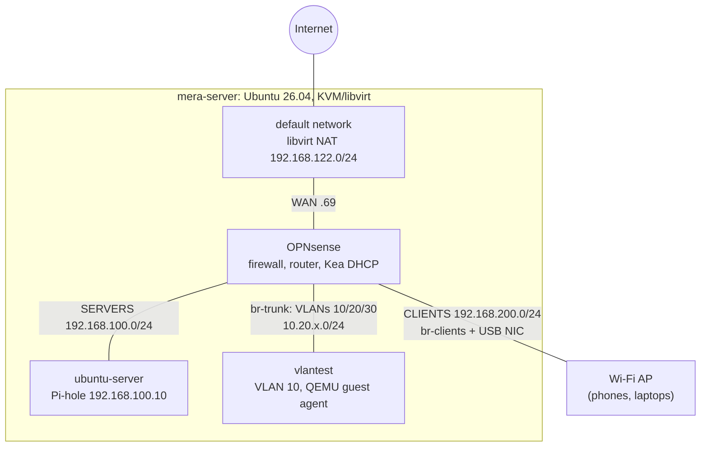

# opnsense-iac-lab

A segmented OPNsense firewall lab on KVM, defined entirely in code.
One command destroys it and rebuilds it from nothing, then verifies it with layered
smoke tests, including a test that the firewall's block rules came back.
**About 7 minutes from nothing to verified.**

```bash
./scripts/rebuild.sh --fresh
```

## Topology



## How it is built

| Piece | Tool | Job |
|---|---|---|
| Network description | `network.json` | Zones, addresses, DHCP pools, VLAN tags: written once, read by everything below |
| Host networking | Ansible | Linux bridges for CLIENTS and the VLAN trunk (netplan) |
| Networks and VMs | Terraform (`terraform/`, libvirt provider) | NAT and isolated networks, three VMs, cloud-init, autostart |
| Firewall, Day 0 | Golden image + generated baseline | Installed OPNsense image; `render-baseline.py` builds its config (interfaces, VLANs, users, API key, certificate) and a boot hook loads it |
| Firewall, Day 1 | Terraform (`policy/`, OPNsense provider) | Aliases, 28 firewall rules and Kea subnets, pushed through the API |
| Services | Ansible | Pi-hole in Docker on the Ubuntu server |
| Orchestration | Bash | `scripts/rebuild.sh`: preflight, secrets, baseline, build, policy, configure, test |
| Verification | Bash + QEMU guest agent | `scripts/smoke.sh`: six layers, host to firewall rules, plus a drift check |

`rebuild.sh` has two modes: **converge** (default: build what is missing, fix drift, safe to
rerun after a failure) and **`--fresh`** (destroy everything, then build from nothing).

## What the smoke tests prove

1. **Host:** bridges up, all VMs running, every VM NIC on the right bridge
2. **OPNsense:** its API answers with the automation key (so the baseline loaded), and
   `terraform plan` in `policy/` shows no changes (**the firewall matches the code exactly**)
3. **Routing:** the host reaches SERVERS through the firewall
4. **Services:** Pi-hole answers DNS; the server reaches the internet through NAT
5. **VLANs:** Kea leased vlantest an address on VLAN 10 (trunk, tagging, DHCP)
6. **Firewall rules,** from *inside* VLAN 10 through the QEMU guest agent, so the test needs
   no network path into the isolated VLAN. Every block is paired with a positive control:
   internet works but the gateway is unreachable; DNS via Pi-hole works but `8.8.8.8` gets no
   reply; TCP 443 out works but DNS-over-TLS (853) is blocked

## Design decisions

- **Firewall as code, in two layers.** A small **baseline** holds only what OPNsense's API
  cannot do (interfaces, VLANs, users, API key, certificate); it is generated from OPNsense's
  own factory config plus `network.json`, and loaded at boot by a hook in the golden image.
  The **policy** (aliases, rules, Kea subnets) is Terraform code pushed through the API. The
  same pattern vendors use: a bootstrap config, then policy from a source of truth.
- **One description of the network.** `network.json` feeds both the baseline generator and
  the policy stack. Client zones share one six-rule pattern, so a new VLAN is one line.
- **Deterministic generation.** Secrets are created once and reused; IDs are derived from
  names. The same inputs give a byte-identical baseline, so the firewall only reloads when
  something actually changed.
- **Least privilege for automation.** Root has no API key; a separate `automation` user does.
  SSH to the firewall is key-only, with lockout on.
- **Moving from restore to code exposed real problems.** The old restored config carried dead
  settings (an old server's DHCP reservation), WireGuard that could never work behind CGNAT, a
  CLIENTS zone that could reach the hypervisor, and VLANs told to use an NTP server they were
  blocked from. The code-built firewall has none of them, and DNS is now forced through Pi-hole.
- **Backups are checked, not trusted.** OPNsense's backup API serves the newest entry in its
  configuration *history*; after a rebuild that was once the factory config, and a rebuild
  loaded it. Backups are now only a safety net, and the backup step rejects factory configs.
- **Hand-built things were brought under code.** libvirt's `default` network (DHCP
  reservation and route) was imported into Terraform; a provider gap forced a planned
  one-time replacement.
- **Nothing important lives in `/tmp`.** The provider writes cloud-init ISOs to `$TMPDIR`,
  which is tmpfs on this host; VMs attach copies in the storage pool, and a Terraform
  `check` block warns if an ISO ever lands in `/tmp`.
- **VMs are cattle.** Drift inside a VM (a hand edit moved vlantest to another VLAN) is fixed
  by rebuilding it from code. The smoke tests caught that drift.
- **Secrets stay out of git.** State, tfvars, host variables, generated secrets and the
  rendered baseline are gitignored or live outside the repo; history is scanned with gitleaks.

## Prerequisites

- **A Linux host.** The libvirt provider and netplan are Linux-only; built and tested on
  Ubuntu Server 26.04, x86-64 with hardware virtualization, 12 GB RAM or more.
- **Host tools:** libvirt/QEMU, Terraform, Ansible (with the `community.libvirt`,
  `community.general` and `community.docker` collections), curl, dig, Python 3, Perl, OpenSSL.
  *(Next: `bootstrap.sh` installs them.)*
- **For the CLIENTS zone:** a USB Ethernet adapter and a Wi-Fi access point.
- **Files kept out of git on purpose.** The repo holds the code, not the data it builds with:
  - the OPNsense **golden image**: too big for git; built once (see REBUILD.md)
  - **machine-specific values:** `terraform.tfvars`, the Ansible `host_vars`, an SSH key
  - **lab secrets** (root password, API key, certificate): generated on the first run by
    `scripts/gen-secrets.sh` into `~/.config/opnsense-iac-lab/`

No OPNsense config backup is needed: the firewall is built from code.
Exact paths and the full rebuild procedure: **[REBUILD.md](REBUILD.md)**.

## Limitations and next steps

- The golden image is built by hand (next: Packer, with a unique root password).
- Tools are installed by hand on the host (next: `bootstrap.sh`, proven on a fresh Ubuntu VM).
- Interface assignment stays in the baseline: OPNsense's API does not cover it.
- Terraform state is a local file (fine for one person; teams use a remote backend).
- Later: a read-only API key for monitoring; generate `network.json` from a CSV parameter
  sheet; trigger rebuilds from CI.

## Repo layout

```
network.json      the network's shape: zones, addresses, pools, VLAN tags
terraform/        networks, VMs, cloud-init, config ISO, guards
policy/           OPNsense aliases, firewall rules, Kea subnets (through the API)
ansible/          host bridges, Pi-hole
scripts/          rebuild.sh, smoke.sh, tapcheck, gen-secrets.sh, render-baseline.py
opnsense-image/   boot hook, OPNsense factory config (secrets removed)
REBUILD.md        runbook: rebuild from scratch, gotchas, automation status
```

---

## Lab details


A segmented home network running as virtual machines on one Ubuntu host
(`mera-server`). OPNsense is the firewall and router; everything else sits
behind it in a zone.

This file is the runbook. It covers the topology, which tool owns which piece,
how to rebuild it, the steps that are still manual, and the things that cost
hours to work out the first time.

---

## Topology in detail

    Internet
       |  (mobile connection, carrier-grade NAT — inbound is impossible)
    Upstream router
       |  Wi-Fi
    mera-server (Ubuntu host)
       |  libvirt NAT, virbr0, 192.168.122.0/24
    OPNsense VM
       |-- vtnet0  WAN       virbr0        192.168.122.69 (reserved)
       |-- vtnet1  SERVERS   virbr2        192.168.100.1/24
       |-- vtnet2  CLIENTS   br-clients    192.168.200.1/24
       +-- vtnet3  trunk     br-trunk      tagged, no address of its own
                                vlan01  VLAN10  10.20.10.1/24
                                vlan02  VLAN20  10.20.20.1/24
                                vlan03  VLAN30  10.20.30.1/24

    SERVERS    ubuntu-server  192.168.100.10  Pi-hole, DNS for everything
    CLIENTS    USB ethernet -> Buffalo AP -> phones and laptops, .200.50-200
    trunk      vlantest VM, tags its own frames for testing

### Why it is built this way

The upstream connection is mobile and behind carrier-grade NAT. Its address
changes on every restart and there is no usable configuration page. So the lab
owns all of its own addressing behind OPNsense, and nothing in this repo
references the upstream network. It renumbered three times in one morning
without affecting anything.

---

## Who owns what

Four bridges exist on the host, created by three different things.

| Bridge       | Zone     | Created by |
|--------------|----------|------------|
| `virbr0`     | WAN      | libvirt, from `libvirt_network.default` (Terraform, `terraform/default_network.tf`) |
| `virbr2`     | SERVERS  | libvirt, from `libvirt_network.servers` (Terraform) |
| `br-clients` | CLIENTS  | Ansible, via netplan (`ansible/bridge.yml`) |
| `br-trunk`   | trunk    | Ansible, via netplan (`ansible/bridge.yml`) |

| Piece | Managed by |
|-------|------------|
| Zones, addresses, pools, VLAN tags | `network.json` |
| `default` network, incl. OPNsense's DHCP reservation and the host route to SERVERS | Terraform (`terraform/`) |
| SERVERS network, all VMs, volumes, cloud-init and config ISOs | Terraform (`terraform/`) |
| `br-clients`, `br-trunk` | Ansible |
| Pi-hole | Ansible |
| OPNsense installed system and boot hook | Golden image (built by hand, see REBUILD.md) |
| OPNsense interfaces, VLAN devices, users, API key, certificate, SSH, Kea on/off | Baseline, generated by `scripts/render-baseline.py` |
| Firewall aliases, rules, Kea subnets | Terraform (`policy/`), through the API |

Terraform refers to `br-clients` and `br-trunk` by name only; it does not create them.
`scripts/smoke.sh` checks both bridges are up, `scripts/tapcheck` checks every VM network card
is attached to the bridge it should be, and the drift check confirms the firewall matches `policy/`.

---

## Rebuild order

One command, from the repo root:

    ./scripts/rebuild.sh            # converge: build what is missing, fix drift
    ./scripts/rebuild.sh --fresh    # destroy everything, then build from nothing

It runs, in order:

1. **Preflight:** tools, golden image, host files
2. **Secrets and baseline:** create missing secrets; render the baseline config
3. **Config backup** from OPNsense's API (safety net only)
4. **Ansible** creates the bridges. VMs attach to them, and a VM cannot start if its bridge does not exist.
5. **Terraform** (`terraform/`) creates the networks, the VMs and their disks; the VMs start themselves
6. **OPNsense** boots the golden image; the boot hook loads the baseline and reboots once
7. **Terraform** (`policy/`) pushes aliases, rules and Kea subnets through the API
8. **Ubuntu server:** wait for SSH, refresh its host key, wait for cloud-init
9. **Ansible** deploys Pi-hole
10. **Smoke tests,** all six layers

Details, failure recovery and the files that are not in git: [REBUILD.md](REBUILD.md).

## What is still done by hand

- **Building the golden image,** rarely: a new OPNsense version or a hook change. Steps in REBUILD.md.
- **Installing the host's tools** (next: `bootstrap.sh`).
- **Restoring the non-git files** onto a new machine (golden image, tfvars, host_vars, SSH key, lab secrets).

Firewall changes are **not** done by hand any more: edit `policy/` or `network.json`, run
`rebuild.sh`, check the smoke tests.

---

## Things that cost hours

**NIC order is load-bearing.** OPNsense names interfaces `vtnet0` to `vtnet3`
in the order they appear in `devices.interfaces`. The restored config assigns
WAN, SERVERS and CLIENTS to 0, 1 and 2. Reorder that list and the restore puts
WAN rules on the servers zone.

**Machine types come from the backup, not from memory.** OPNsense wants
`pc-i440fx-resolute`; the Ubuntu server wants `pc-q35-10.2`. An old q35 version
(`pc-q35-6.2`) boots but the guest never sees its virtio disk — it drops to an
initramfs prompt saying the root filesystem does not exist, and `ls /dev/vd*`
shows nothing. The fix is the machine type, not permissions.

**OPNsense needs ACPI and APIC.** Without them its FreeBSD kernel panics at
boot with "running without device atpic requires a local APIC". Virt-Manager
adds these silently; this provider does not.

**Declare the disk format.** A disk without `driver = { type = "qcow2" }`
fails with "Permission denied", because QEMU refuses to guess a format and
reports the closest errno it has. The message is misleading — check the format
before the permissions.

**Declare the backing chain too.** A layered disk needs `backing_store` on the
domain's disk as well as on the volume. Without it QEMU will not follow the
chain into the base image.

**Use `source.file`, not `source.volume`.** The volume form, which refers to a
pool and a volume name, did not work here. A direct file path does, and it
matches what a working VM's XML looks like.

**Pools and volumes are immutable.** Every change requires replacement, and
replacing a pool takes its volumes with it. `terraform plan` may still describe
the change as in-place; the provider refuses at apply time.

**Volume ownership drifts.** libvirt chowns a disk to `libvirt-qemu` when its
VM starts and back to root when it stops, so a stopped VM's disk always differs
from the config. `lifecycle { ignore_changes = [target] }` stops this appearing
in every plan.

**cloud-init locks passwords by default.** `passwd:` alone puts the hash in
`/etc/shadow` with a `!` in front, which means locked. `lock_passwd: false` is
required as well.

**Changing the bridges unplugs the VMs.** `netplan apply` restarts
NetworkManager, which rebuilds `br-clients` and `br-trunk` with only the ports
it knows about. libvirt's tap devices are not among them, so OPNsense silently
loses its CLIENTS and trunk connections. Stop OPNsense before changing bridges,
or run `ops tapcheck` afterwards and restart it.

---

## Local values

`terraform.tfvars` is gitignored. Copy the example and fill it in:

    qemu_uid              id -u libvirt-qemu
    kvm_gid               getent group kvm | cut -d: -f3
    opnsense_iso          path to the installer ISO
    console_password_hash openssl passwd -6
    vm_user               defaults to ubuntu
    opnsense_machine      defaults to pc-i440fx-resolute
    server_machine        defaults to pc-q35-10.2

The ISO must be somewhere QEMU can read — `/var/lib/libvirt/isos/` rather than
your home directory, which is not traversable by `libvirt-qemu`.
